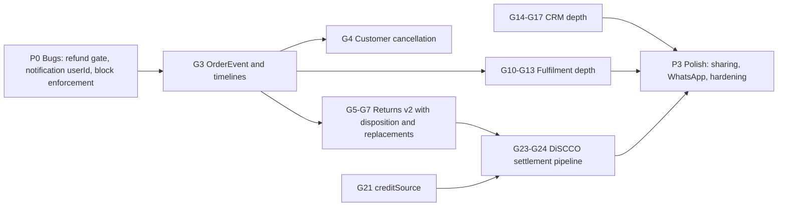

# Supplier Module — Gap Analysis Guide

**Audit date:** 22 July 2026
**Reference:** Client brief "Horeca1 Supplier Journey — Developer Guide" (16 July), Sections 1–15
**Audited against:** current `master` codebase (Next.js 16 / Prisma 7 / PostgreSQL 16)

This document compares every rule and UI flow in the client brief against what is actually implemented in the codebase, with exact file references. It ends with a prioritized roadmap and a short list of business questions that need a client decision before coding.

**Verdict legend:**

| Verdict | Meaning |
|---|---|
| ✅ EXISTS | Implemented and usable end-to-end |
| 🟡 PARTIAL | Present but incomplete, or implemented differently than the brief |
| ❌ MISSING | Not implemented |

---

## 1. Executive Summary

| Section | Topic | Readiness | One-line status |
|---|---|---|---|
| S1 | Supplier Foundation | ✅ ~95% | Hierarchy, KYC, pincodes, RBAC, setup wizard, go-live all shipped |
| S2 | Product & Catalog | ✅ ~90% | Master catalog + per-store listings + approval + bulk import all shipped |
| S3 | Inventory | ✅ ~95% | Reserve/release/finalize + full InventoryLog + history UI + stock-take + low-stock events; soft gaps: brand/category filters |
| S4 | Pricing & Pricelists | ✅ ~90% | Slabs + pricelists + single shared resolver with correct priority |
| S5 | Customer Management (CRM) | 🟡 ~55% | Core CRM exists; leads pipeline, timeline, discovery, store-sharing missing |
| S6 | Supplier-backed Credit | ✅ ~85% | CreditWallet per (customer, vendor) with terms and overdue engine |
| S7 | Order Management | 🟡 ~70% | Lifecycle + partial accept + invoices shipped; event history, customer cancel, bulk actions missing |
| S8 | Fulfilment & Delivery | 🟡 ~60% | Picklist/dispatch/OTP POD shipped; delivery executive, failed delivery, labels missing |
| S9 | Returns, Claims & Replacements | 🟡 ~40% | Order-level request/review/refund only; item-level, inspection, disposition, replacement, restock missing. **Contains a P0 refund bug.** |
| S10A | Supplier Ledger & Settlements | ✅ ~80% | Wallet ledger + settlement batches + UTR; DiSCCO summary card and immutability hardening pending |
| S10B | Platform Accounting | 🟡 ~60% | Fee snapshots + admin ledger exist; no dedicated double-entry ledger engine |
| S11 | Brand Store & Distributor Mapping | ✅ ~90% | Full brand portal, mappings, authorized-distributor dual approval |
| S12 | Reports & Analytics | ✅ ~85% | Admin, vendor and brand reports with CSV export |
| S13 | Notifications | 🟡 ~75% | Email/SMS/in-app/push live; WhatsApp stubbed; prefs not enforced at send time |
| S14 | Admin & Configuration | ✅ ~90% | Settings, categories, team RBAC, approvals, credit config all shipped |
| S15 | Promotions & Marketing | ✅ ~85% | Coupons, cashback, vendor promos (%, flat, BXGY), combos, collections |

**Overall: roughly 75–80% of the brief is already live.** The biggest deltas are in Returns (S9), Order event history / customer cancellation (S7), CRM depth (S5), and Fulfilment depth (S8). Two confirmed correctness bugs need immediate fixes regardless of the roadmap (see [Section 4 — P0](#p0--correctness-bugs-fix-immediately)).

### Terminology mapping (brief ↔ codebase)

The brief and the code use different names for the same concepts. Keep this table handy when reading either.

| Brief term | Codebase entity | Where |
|---|---|---|
| Supplier | `User` (HCID) | `prisma/schema.prisma` |
| Business | `BusinessAccount` | `prisma/schema.prisma` |
| Online Store / Branch | `Vendor` | `prisma/schema.prisma` |
| Outlet / stock location | `Outlet` (per-store warehouse; `Vendor.defaultOutletId`) | `prisma/schema.prisma` |
| Platform Catalog | `MasterProduct` | `prisma/schema.prisma` |
| Online Store Product Catalog | `Product` (with `vendorId` + `masterProductId`) | `prisma/schema.prisma` |
| Delivery Area | `ServiceArea` (vendorId + outletId + pincode) | `prisma/schema.prisma` |
| Customer Pricelist | `PriceList` / `PriceListItem` / `PriceListAssignment` / `VendorCustomerPrice` | `prisma/schema.prisma` |
| Credit Line (DiSCCO) | `CreditWallet` (+ `CreditWalletTxn`, `GlobalCreditConfig`) | `prisma/schema.prisma` |
| My Customers (CRM record) | `VendorCustomer` | `prisma/schema.prisma` |
| Settlement Account / Ledger | `VendorWallet` / `VendorWalletTxn` / `VendorSettlement` | `prisma/schema.prisma` |
| Team Member | `VendorTeamMember` + `AccountRole` / `UserRole` | `prisma/schema.prisma` |

---

## 2. Section-by-Section Audit

### Section 1 — Supplier Foundation ✅

| Brief requirement | Verdict | Where / notes |
|---|---|---|
| Registration: mobile OTP → email → password | ✅ EXISTS | 7-step wizard at `src/app/vendor/register/page.tsx`; OTP via `POST /api/v1/auth/otp/send` + `verify`; submit at `src/app/api/v1/vendor/onboarding/submit/route.ts`. Email OTP is opt-in via `src/lib/config/registerEmailOtp.ts`. |
| KYC form (GST, FSSAI, billing/shipping address, bank details) | ✅ EXISTS | `Vendor` model fields: `gstNumber`, `panNumber`, `fssaiNumber`, `bankAccountName/Number/Ifsc`, billing + pickup addresses. |
| Document upload (GST, FSSAI, cancelled cheque) | ✅ EXISTS | `VendorDocument` model (types: `gst`, `fssai`, `pan`, `bank_proof`, `other`). Upload: `POST /api/v1/vendor/documents`. UI: `src/components/features/vendor/settings/DocumentsTab.tsx`. "Cancelled cheque" is implemented as `bank_proof`. |
| Horeca1 verification: Approve / Reject / **Hold** | 🟡 PARTIAL | Approve/reject exists (`PATCH /api/v1/admin/vendors/[id]` toggles `isVerified`/`isActive`; doc-level verify/reject at `.../documents/[docId]`). **No formal "hold" state** — lifecycle is boolean flags, not an enum with `pending / approved / rejected / hold`. |
| Supplier → Business → Online Store hierarchy | ✅ EXISTS | `User` (HCID) → `BusinessAccount` → `Vendor` documented in `src/modules/supplier/foundation.service.ts`. One BusinessAccount can own many Vendor (store) rows. |
| Business / Online Store switcher | ✅ EXISTS | `src/hooks/useBusinessAccountSwitcher.ts`; APIs `POST /api/v1/auth/switch-business-account`, `switch-online-store`, `switch-outlet`; pages `/vendor/businesses`, `/vendor/businesses/[id]`. |
| Create / edit / disable Online Store | ✅ EXISTS | `/api/v1/supplier/businesses`, `/api/v1/supplier/stores`, `/api/v1/supplier/stores/[id]`; disable = `isActive: false`. |
| Delivery-area pincode assignment | ✅ EXISTS | `ServiceArea` model (unique on `[vendorId, outletId, pincode]`); vendor UI Settings → Delivery tab (`DeliveryTab.tsx`); API `/api/v1/vendor/settings/service-areas`. |
| Pincode conflict check | 🟡 PARTIAL | `assertPincodeAvailableForSupplier` in `foundation.service.ts` blocks the **same supplier** assigning one pincode to two stores. There is **no cross-supplier exclusivity** — multiple different suppliers can serve the same pincode (this matches a marketplace; the brief's Flow 17 is ambiguous — see [client questions](#5-questions-for-the-client)). |
| Team member invite / role / remove, Business- vs Store-scoped | ✅ EXISTS | `VendorTeamMember` + `AccountRole`/`UserRole` (scope `business` or `store`); APIs `/api/v1/vendor/team`, `/api/v1/vendor/team/[id]`, custom roles `/api/v1/vendor/roles`; UI `/vendor/team`. Business-level members cascade to child stores, matching the brief's proposed rule. |
| First-time setup wizard | ✅ EXISTS | `/vendor/setup` (`src/app/vendor/setup/page.tsx`), progress in `Vendor.setupProgress`, steps: business, online_store, delivery, team, profile, products, inventory, credit, payment_modes, go_live. |
| Go Live (requires ≥1 product) | ✅ EXISTS | `assertGoLiveReady` requires verification, ≥1 pincode, store name, ≥1 product. Storefront visibility gated on `isActive && isVerified` in `src/modules/vendor/vendor.service.ts`. |

**Gaps to close:** formal `hold` KYC status (S), decide the pincode-exclusivity question with the client.

---

### Section 2 — Product & Catalog Management ✅

| Brief requirement | Verdict | Where / notes |
|---|---|---|
| ONE Platform Catalog maintained by Horeca1 | ✅ EXISTS | `MasterProduct` model (globally unique SKU). Admin master-catalog APIs at `/api/v1/admin/master-products/**`. |
| Every Online Store owns its own catalog / SKUs / pricing | ✅ EXISTS | `Product.vendorId` + `Product.masterProductId`; per-vendor SKU (`sku`, `vendorSku`), slug unique per vendor. |
| Search Platform Catalog before creating; auto-fill on match | ✅ EXISTS | Vendor product creation flows through `src/modules/catalog/catalog.service.ts`; listing from an approved master / brand master / existing approved product is **instant-approved**. |
| New product → submit → admin approve → joins Platform Catalog | ✅ EXISTS | `ApprovalStatus` enum (`pending`, `approved`, `rejected`, `pending_edit`, `under_review`, `needs_changes`, `archived`); admin UI `/admin/approvals` + `ApprovalReviewDrawer`; master-sync at `src/modules/catalog/master-sync.service.ts`. Material edits on live products queue as `pending_edit`. |
| SKU unique per Online Store | 🟡 PARTIAL | Enforced in **app code** (`assertVendorSkuUnique` / `assertVendorPosSkuUnique` in `catalog.service.ts`) but no DB unique constraint on `(vendorId, vendorSku)` — schema only has `@@index`. Race conditions could create duplicates. |
| Delete only when no transactions | ✅ EXISTS | Hard delete when no order history; otherwise tombstoned (slug prefixed `_deleted_`). |
| Draft / publish / unpublish / archive / enable / disable | 🟡 PARTIAL | All achievable via `listingStatus` (`draft`/`submitted`) + `isActive` + `archivedAt`, but there is **no single product-status enum**, so "publish/unpublish" is a composition of fields rather than an explicit state. Functionally fine. |
| Primary + additional categories | ✅ EXISTS | `Product.categoryId` (primary) + `ProductCategory` join with `isPrimary`; max 5; leaf-category validation (`assertLeafCategory`). |
| Image upload / replace | ✅ EXISTS | ImageKit via `POST /api/v1/upload` (`src/lib/imagekit.ts`); `imageUrl` + `images[]`. |
| Bulk upload with template, validation and error report | ✅ EXISTS | `src/modules/import-export/` — template (`GET .../import?template=true`), preview→commit, error-report CSV (`buildImportErrorReportCsv`); vendor route `src/app/api/v1/vendor/products/import/route.ts`. |
| Bulk update / bulk activate / deactivate | ✅ EXISTS | `vendor/products/bulk-update`, `vendor/products/bulk-price`; grid UI `VendorBulkGrid`. |
| Search / filter products | ✅ EXISTS | `/vendor/products` page with filters (all/active/inactive/featured/drafts) + search. |

**Gaps to close:** DB-level unique constraint on `(vendorId, vendorSku)` (S).

---

### Section 3 — Inventory & Stock Management 🟡

| Brief requirement | Verdict | Where / notes |
|---|---|---|
| Inventory belongs to the Online Store, never the Business | ✅ EXISTS | `Inventory` unique on `[productId, outletId]`; outlets belong to a store (`Vendor`). Fields: `qtyAvailable`, `qtyReserved`, `qtyInTransit`, `qtyDamaged`, `qtyReturned`, `lowStockThreshold`. |
| Opening stock, increase/reduce, adjustment with reason | 🟡 PARTIAL | Live qty edit via `InventoryService.updateStock` / `bulkAdjustStock` + `/vendor/inventory`. Opening stock lives in `Product.metadata.inventory.openingStock` (not a first-class inventory field). Free-text adjustment reason + stock-take UI added for brief parity. |
| Every stock movement creates a history record | 🟡 PARTIAL → ✅ | `InventoryLog` written by `logInventoryChange` on manual update, GRN, **and** reserve / release / finalize / bulk / transfer / stock-take. History API + vendor UI panel list movements. |
| Stock reduces on order (brief says: after payment) | 🟡 PARTIAL (by design — **kept**) | **Decision (Rule 5):** keep `reserveStock` at order creation, `releaseStock` on cancel, `finalizeStock` on delivery. Safer against overselling than brief-literal post-payment reserve. Documented; do not change without stakeholder sign-off. |
| Out of stock: product stays in catalog, ordering disabled | ✅ EXISTS | Contextual: with a delivery pincode, zero-sellable SKUs are hard-hidden (`hardHideZero` in `catalog.service.ts`); otherwise listed with stock status; product page shows OOS alternates. `Vendor.autoDisableOos` exposed in vendor settings. |
| Low-stock alert configuration + notification | 🟡 PARTIAL → ✅ | Threshold per row + dashboard filters; `StockUpdated` fires on manual updates **and** order-driven finalize/reserve when sellable ≤ threshold. Listener resolves `userId` via `resolveVendorUserId`. |
| Bulk inventory update (template, validate, error report) | ✅ EXISTS | `vendor/inventory/import` / `export` + `inventoryExcel.service.ts`; downloadable error XLSX for skipped rows; admin bulk at `admin/inventory/bulk`. |
| Physical stock verification / reconciliation | ✅ EXISTS | Stock-take: enter physical count → variance preview → approve → adjust + `InventoryLog` (`reason: stock_take`). |
| Export inventory report | ✅ EXISTS | `vendor/inventory/export`. |
| Inventory history / movement UI | ✅ EXISTS | `GET /api/v1/vendor/inventory/history` + per-row history panel on `/vendor/inventory`. |

**Gaps remaining (soft):** brand/category inventory filters; dedicated disable-ordering flag separate from `Product.isActive` (optional). Rule 5 kept as reserve-at-order by design.

---

### Section 4 — Pricing, Bulk Pricing & Pricelists 🟡 (~90% core; history/template gaps)

Full scorecard: [`docs/SECTION4-PRICING-GAP-ANALYSIS.md`](SECTION4-PRICING-GAP-ANALYSIS.md) · Manual guide: [`docs/SECTION4-PRICING-TEST-GUIDE.md`](SECTION4-PRICING-TEST-GUIDE.md) · E2E: `e2e/vendor-pricing-section4.spec.ts`

| Brief requirement | Verdict | Where / notes |
|---|---|---|
| Default selling price per Online Store product | ✅ EXISTS | `Product.basePrice`; product form Pricing & GST; publish requires price &gt; 0. |
| Bulk pricing slabs (3 tiers, qty ranges) | ✅ EXISTS | `PriceSlab`. UI + **API Zod `.max(3)`**. |
| Customer-specific pricelists override default | ✅ EXISTS (brief said “later”) | `PriceList` / items / assignments + `VendorCustomerPrice`; UI `/vendor/price-lists`. |
| Single price-resolution helper reused everywhere | ✅ EXISTS | `resolveUnitPrice` + `attachCustomerPricing`. Priority: customer → slab → base. |
| Bulk price update via Excel | ✅ EXISTS | **Replace Prices** + `GET/POST /api/v1/vendor/products/price-update` (price-only). |
| Price history | ✅ Done | Dedicated `PriceHistory` table; dual-write on product + pricelist edits; product + customer history UIs |
| Pricing search / brand-category-pricelist filters | 🟡 | Brand + Category filters on Products; pricelist filter still open. |
| Price calculation (PDP, cart, checkout) | ✅ EXISTS | Shared resolver. |
| Playwright coverage | ✅ | `e2e/vendor-pricing-section4.spec.ts`. |

**Still open:** pricelist filter on Products.

---

### Section 5 — Customer Management (CRM) 🟡

This is the section with the biggest philosophical delta. The brief describes a **central customer repository that every supplier can browse** plus an independent per-supplier CRM. Current implementation has the per-supplier CRM but **no cross-platform customer discovery**.

| Brief requirement | Verdict | Where / notes |
|---|---|---|
| Vendor "Customers" section | ✅ EXISTS | `/vendor/customers` (`src/app/vendor/(dashboard)/customers/page.tsx`); API `GET/POST /api/v1/vendor/customers` returning CRM records with `orderCount`, `totalSpend`, `lastOrderAt`. |
| One central customer repository, browsable by all suppliers | ❌ MISSING | `BusinessAccount` is the central customer master, but only **admin** can browse it (`/admin/customers`). Vendors only see customers who ordered from them, are CRM-mapped, or have a credit wallet. No "All Customers" discovery view with public profile (name/category/city) and hidden private fields. |
| Privacy: private fields hidden unless "My Customer" | 🟡 PARTIAL | Effectively enforced by omission (vendors see only their own customers), but there is no public/limited customer profile to apply masking to. |
| Leads: add lead → Horeca1 validation → central repo → convert on first purchase | ❌ MISSING | `BusinessAccount.leadStatus` exists as an **admin** field; there is no vendor-facing lead capture, validation queue, or lead→customer conversion flow. |
| "Add to My Customers" | 🟡 PARTIAL | `VendorCustomer` record can be created by the vendor (`POST /api/v1/vendor/customers`), and is auto-linked on first order — but only for customers the vendor already knows (no discovery to add from). |
| Tags | ✅ EXISTS | `VendorCustomer.tags` + UI. |
| Customer groups | ✅ EXISTS | `CustomerGroup` / `CustomerGroupMember`; page `/vendor/customer-groups`; used for pricelist targeting. |
| Internal notes | ✅ EXISTS | `VendorCustomer.notes`. |
| Salesperson assignment | ✅ EXISTS | `VendorCustomer.salespersonId` → `Salesperson`; `/vendor/sales-team`; commission hooks (`CommissionRule` / `CommissionAccrual`). |
| Pricelist assignment | ✅ EXISTS | `VendorCustomer.priceListId` + `PriceListAssignment`. |
| Credit assignment (opens credit module) | ✅ EXISTS | Vendor credit assign at `POST /api/v1/vendor/credit`. |
| Tasks / follow-ups | ✅ EXISTS | `VendorCustomerTask` + section on customers page (light version of brief's CRM engagement). |
| CRM timeline (every interaction recorded) | ❌ MISSING | No activity/timeline model or UI for customer interactions. |
| Customer profile detail page with purchase history & frequent products | ❌ MISSING | No `/vendor/customers/[id]` page; list shows aggregates only. Order history lives separately under `/vendor/orders`. |
| Customer blocking (per supplier only) | 🟡 PARTIAL | `VendorCustomer.status` (`active`/`blocked`/`suspended`) is editable, but **not enforced** at checkout/order creation — a blocked customer can still order. Only `allowedPaymentModes` is enforced. |
| Filters (My/Active/Leads/Never Ordered/Inactive 30-60-90/High Value…) | 🟡 PARTIAL | Basic filters exist; behavioral filters (never-ordered-in-my-pincodes, inactivity windows, high-value thresholds) not built. |
| Share store: link / QR / WhatsApp broadcast / social | ❌ MISSING | No store share link UI, no QR generation, no WhatsApp broadcast. `src/lib/providers/whatsapp.ts` is a notification stub, not a broadcast tool. |
| Bulk import leads, bulk assign tags/pricelist/credit | 🟡 PARTIAL | Bulk pricelist/credit application paths exist; no lead import, no bulk tag assign UI. |

**Gaps to close:** customer discovery + limited public profile (L), leads pipeline (M), CRM timeline (M), customer detail page with purchase history (M), enforce block status at checkout (S), store share link/QR (S), WhatsApp broadcast (M, depends on WhatsApp provider), behavioral filters (M).

---

### Section 6 — Supplier-backed Credit (DiSCCO) ✅

The live system is `CreditWallet` (the older `CreditAccount`/`CreditTransaction` models are retired; do not write to them — see the shim comment in `src/modules/credit/credit.service.ts`).

| Brief requirement | Verdict | Where / notes |
|---|---|---|
| Credit belongs to the Supplier–Customer relationship | ✅ EXISTS | One `CreditWallet` per `(userId, vendorId)`; `vendorId = null` means an H1 platform wallet. A customer may hold independent wallets with many suppliers — exactly the brief's model. |
| Vendor assigns credit (limit + terms) | ✅ EXISTS | `POST /api/v1/vendor/credit` (requires `creditLine.approve` permission; target must have ordered / be CRM-mapped / have a wallet). Admin path: `POST /api/v1/admin/credit/assign`. |
| Available credit = limit − outstanding; auto-calculated | ✅ EXISTS | Maintained on every debit/repay/reversal in `src/modules/credit/creditWallet.service.ts` (`creditLimit`, `availableCredit`, `usedCredit`, `outstandingAmount`). |
| Credit terms: due date, grace, penalty, interest | ✅ EXISTS | Per-wallet overrides + `GlobalCreditConfig` defaults (tenure, grace, blacklist days, interest/penalty rates and frequencies). Due date set on first utilization. |
| Order validation before confirmation; block if insufficient | ✅ EXISTS | `debitWallet` validates status, repayment mode, available balance; `Product.creditEligible` gate; per-customer `allowedPaymentModes`; checkout eligibility via `GET /api/v1/credit/check`. |
| Release on cancel | ✅ EXISTS | `reverseOrderDebit` → `REVERSAL` txn. |
| Reserved → outstanding on delivery | 🟡 PARTIAL (by design) | Outstanding is set **at debit time** (checkout), not deferred until delivery. Simpler; deviates from the brief's two-stage model. Flag to client. |
| Suspend / freeze / cancel; statuses | 🟡 PARTIAL | Statuses are `ACTIVE / BLOCKED / BLACKLISTED` (+ CRM `workflowStatus`), not the brief's `active/suspended/frozen/expired`. No credit-validity expiry that auto-suspends. |
| Credit Source field (Supplier / Horeca1 / NBFC / Bank) | ❌ MISSING | Brief explicitly asks for this from day one. Today the implicit source is `vendorId == null` (H1) vs set (supplier). Add an explicit `creditSource` enum column (S). |
| Credit history / transactions / statements | ✅ EXISTS | `CreditWalletTxn` (`CREDIT_ASSIGN`, `ORDER_DEBIT`, `REPAYMENT`, `PENALTY`, `REVERSAL`); statement route `vendor/credit/[walletId]/statement`; reports `wallet/reports`. |
| Overdue engine + alerts | ✅ EXISTS | `processOverdueAccounts` cron (`admin/credit/cron`): penalties, interest, reminders, auto BLOCK/BLACKLIST; vendor collections UI (`CreditCollectionsPanel`); repayment incl. Razorpay under `/api/v1/wallet/*`. |
| Bulk assign / bulk update credit | 🟡 PARTIAL | Single-wallet assign only; no bulk-select assign flow. |

**Gaps to close:** `creditSource` enum (S), expiry/auto-suspend status semantics (M), bulk credit assignment (M).

---

### Section 7 — Order Management 🟡

| Brief requirement | Verdict | Where / notes |
|---|---|---|
| Order lifecycle with defined transitions | ✅ EXISTS | `OrderStatus`: `draft → pending → confirmed → processing → ready_for_dispatch → shipped → partially_delivered → delivered → returned / cancelled`. Enforced by `VALID_TRANSITIONS` in `src/modules/order/order.service.ts`. |
| Order dashboard: list, filters, search, detail | ✅ EXISTS | `/vendor/orders` + `/vendor/orders/[id]`; API filters status, search, date, payment status, outlet scope. |
| Unique order number | ✅ EXISTS | `Order.orderNumber` `@unique` (`PO-{year}-…`); not a gap-free DB sequence but collision-safe. |
| Accept / reject full order | ✅ EXISTS | `pending → confirmed`; reject = `cancelled` with mandatory `rejectionReason`. |
| Partial acceptance (accept some items, reduce quantities) | ✅ EXISTS | `OrderService.partialAccept()` — PATCH body `{ items: [{ itemId, fulfilledQty }] }`; post-confirm amendment via `amendOrderLines()`. |
| **Order immutability + Order Events** | ❌ MISSING | The brief's central rule. Today partial acceptance and amendments **edit the order in place** (`fulfilledQty`, `subtotal`, `totalAmount` are mutated). There is **no `OrderEvent` / status-history table** — the timeline shown in UI (`src/components/features/finance/StatusTimeline.tsx`) is *derived* from current status, not recorded history. The generic `AuditLog` is not an order activity feed. This is the largest structural gap in S7. |
| Pricing locked at order time | ✅ EXISTS | `OrderItem` snapshots (`productName`, `productSku`, `hsn`, `taxPercent`, `unitPrice`, …) via `src/modules/order/order-snapshots.ts`; invoices read snapshots (`src/lib/invoice-items.ts`). |
| Invoice from accepted quantities | ✅ EXISTS | `src/lib/invoice.ts` (GST PDF) + `invoice-items.ts` bills `fulfilledQty` when `isPartial`. Customer/vendor/admin invoice routes exist. **IGST** when seller/buyer states differ (`gstPlaceOfSupply.ts`); else CGST+SGST. |
| Vendor cancels pending order (with reason) | ✅ EXISTS | Any reserved state → `cancelled`; stock released, credit/promo reversed. |
| **Customer cancellation / cancellation-request review** | ❌ MISSING | No customer cancel API at all. `DELETE /api/v1/orders/:id` only hard-deletes drafts or hides the order (`customerDeleted`). No request→vendor-review flow. |
| Order timeline / status history / activity log views | ❌ MISSING | Depends on the missing Order Events model above. |
| Bulk actions: accept, status update, invoice print, export | ❌ MISSING | No bulk order APIs or UI. Vendor reports are aggregates only. |
| Who/when on every action | 🟡 PARTIAL | Some actions audited in `AuditLog`; no systematic per-order actor/time record (again → Order Events). |

**Gaps to close:** Fulfilment depth lives in S8. Section 7 order keystone (OrderEvent, cancel review, bulk, IGST) is shipped — see `docs/SECTION7-ORDER-GAP-ANALYSIS.md`.

---

### Section 8 — Fulfilment & Delivery 🟡

| Brief requirement | Verdict | Where / notes |
|---|---|---|
| Only accepted orders enter fulfilment | ✅ EXISTS | Picklists generated from confirmed orders; status graph prevents skipping. |
| Picking task / picklist | ✅ EXISTS | `Picklist` model (`draft/printed/picked/cancelled`), `src/modules/warehouse/warehouse.service.ts`, APIs `vendor/warehouse/picklists`, printable pick slip `vendor/orders/[id]/picklist`, UI `/vendor/warehouse`. Picked advances order to `processing`/`ready_for_dispatch`. |
| Picking exceptions (item missing / short) | 🟡 PARTIAL | Handled indirectly via partial fulfillment quantities; no explicit exception record. |
| Packing step + package labels | ❌ MISSING | No packing state or package/label entity; flow jumps pick → dispatch. |
| Delivery assignment: executive / vehicle / 3PL | 🟡 PARTIAL | `Dispatch` model stores free-text `driverName` + `vehicleNumber`. **No delivery-executive entity/roster, no 3PL integration.** Brief's Flow 25 (delivery-resource history) impossible without an entity. |
| Dispatch → out for delivery → delivered | ✅ EXISTS | `createDispatch` → order `shipped`; dispatch delivered → order `delivered` (`vendor/warehouse/dispatches`). |
| POD: OTP / signature | 🟡 PARTIAL | OTP POD is solid: `deliveryOtp*` fields, `POST vendor/orders/[id]/delivery-otp`, auto-issued on order creation, customer receives code by SMS. Photo + notes also supported. `signature` exists in the validator enum but has **no capture UX**. |
| Failed delivery: reasons, never auto-completes, re-delivery | ❌ MISSING | No failed-delivery status, no exception reasons, no re-delivery scheduling (only slot/date reschedule of a live order). |
| Delivery slots | ✅ EXISTS | `DeliverySlot` model + cutoff enforcement at order create; customer picker `DeliverySlotPicker.tsx`; vendor settings `vendor/settings/delivery-slots`. |
| Multi-outlet fulfilment routing | ✅ EXISTS (bonus) | `src/modules/fulfillment/fulfillmentRouter.service.ts` picks the fulfilling outlet by stock/geo; stamps `fulfillmentOutletId`. Not in the brief but aligned with it. |
| Bulk assign / bulk dispatch / print challans | ❌ MISSING | No bulk fulfilment actions. |
| Delivery performance report | 🟡 PARTIAL | General vendor reports exist; no dedicated delivery-performance report. |

**Gaps to close:** `DeliveryExecutive` entity + assignment (M), failed-delivery + re-delivery workflow (M), packing state + labels (M), signature capture (S), bulk fulfilment actions (M), delivery reports (S). A "Fulfilment Workspace" single-screen UI (brief's recommendation) is a UI composition task once the states exist (M).

---

### Section 9 — Returns, Claims & Replacements 🟡 (weakest section — contains a P0 bug)

Current model: `ReturnRequest` — **one per order** (`@@unique([orderId])`), free-text reason, string status, `resolutionType` (`refund` / `credit_note` / `replacement`), `creditNoteNumber/Amount`, `refundAmount`. Service: `src/modules/return/return.service.ts`.

| Brief requirement | Verdict | Where / notes |
|---|---|---|
| Customer requests return on delivered order | ✅ EXISTS | `POST /api/v1/orders/[id]/return` + UI on `src/app/orders/[id]/page.tsx` (delivered only, reason ≥10 chars). |
| Vendor review approve/reject | ✅ EXISTS | `/vendor/returns` + `vendorReviewReturn` (approve/reject, resolution type, credit-note number generation, credit-wallet reversal). |
| Admin refund processing | ✅ EXISTS (with bug) | `/admin/returns` + `adminProcessReturnRefund`. |
| **P0 BUG — gateway refunds never fire** | ❌ BUG | `return.service.ts` line ~209: `const isRazorpay = order.paymentMethod === 'razorpay' && …` — but checkout stores `paymentMethod: 'online'` for Razorpay orders (see `order.service.ts`). For every real online order, `isRazorpay` is false, **no Razorpay refund is created**, yet the return is still marked `refunded` and the order `paymentStatus: 'refunded'`. The customer never gets the money while the system reports success. Fix: match `'online'` (or better, check for a captured `Payment` row). |
| Item-level (partial) returns | ❌ MISSING | No `ReturnItem` model; whole-order returns only; one return per order (`@@unique([orderId])`) also violates the brief's "multiple returns per order" rule. |
| Structured return reasons | ❌ MISSING | Free text only; brief lists an enum (wrong/damaged/expired/short supply/…). |
| Photo/evidence request flow | ❌ MISSING | No attachment support on returns. |
| Pickup scheduling | ❌ MISSING | — |
| Goods receipt + inspection for returns | ❌ MISSING | The existing `GoodsReceipt` in the warehouse module is **inbound supplier stock**, not returns intake. |
| **Disposition** (saleable / return-to-brand / damaged / expired / scrap / QA hold) | ❌ MISSING | Brief calls this the bridge field to inventory/brand claims. `Inventory` already has `qtyDamaged` / `qtyReturned` buckets to receive it. |
| Inventory restock after verified return | ❌ MISSING | No restock happens on approve/refund today. |
| Replacement generates a new linked order | ❌ MISSING | `resolutionType: 'replacement'` just closes the return as `resolved`; no replacement order is created. |
| Credit note references original invoice; CN document | 🟡 PARTIAL | CN number generated + optional credit-wallet application; **no credit-note PDF** and no invoice linkage field. |
| Return status history / timeline | ❌ MISSING | UI-only derived timeline; no recorded events (same fix as Order Events). |
| Return reports | 🟡 PARTIAL | Returns appear in admin finance seed/screens; no dedicated return-analysis reports. |
| Return never modifies original order/invoice | ✅ EXISTS (principle held) | Returns are separate rows; the original order is only status-flipped to `returned`. |

**Gaps to close:** fix refund gate (P0, S), `ReturnItem` + multiple returns per order (L), structured reasons + photos (S), pickup/receipt/inspection/disposition workflow with inventory integration (L), replacement-order generation (M), CN PDF + invoice reference (S), return events/timeline (rides on Order Events, S).

---

### Section 10A — Supplier Ledger, Collections & Settlements ✅

Implemented under different names: `VendorWallet` (balance) + `VendorWalletTxn` (ledger: `order_credit`, `settlement_debit`, `adjustment`, `refund_debit`) + `VendorSettlement` / `VendorSettlementOrder` (batches). Service: `src/modules/vendor/vendorSettlement.service.ts`.

| Brief requirement | Verdict | Where / notes |
|---|---|---|
| System-generated entries; suppliers never create them | ✅ EXISTS | Wallet credited automatically on delivery (`creditVendorOnDelivery`); commissions and gateway fees deducted from snapshot fields on `Order` (`settlementGrossAmount`, `settlementPlatformFee`, `settlementGatewayFee`, `settlementNetVendorAmount`). |
| Platform commission | ✅ EXISTS | `Vendor.platformFeePct` override or `PlatformSetting.defaultCommissionPct` (default 10%); gateway fee 2% for online payments. |
| Entries immutable, corrections via adjustments | 🟡 PARTIAL | Ledger is append-style and adjustments exist (admin POST `vendor/wallet` type `adjustment`), but nothing *hard*-prevents updates (no DB trigger/hash chain). Convention, not constraint. |
| Every entry references its source transaction | ✅ EXISTS | Txns reference orders/settlements; batch model links orders (`VendorSettlementOrder`). |
| Settlement dashboard, timeline, statements | ✅ EXISTS | Vendor `/vendor/wallet` + `/vendor/ledger`; admin `/admin/finance`, `/admin/ledger` with CSV export; APIs `vendor/wallet`, `vendor/ledger`, `admin/settlements`. |
| Settlement batches + payout + UTR | ✅ EXISTS | `createSettlementBatch`, `markSettlementTransferred` (bank reference), `requestInstantPayout`; cron at `admin/settlements/cron`. |
| Refunds reduce receivable after posting | ✅ EXISTS | `debitVendorOnRefund` called from return refund flow. |
| **DiSCCO settlement rules** (credit sale payable only after customer pays) | 🟡 PARTIAL | `creditVendorOnDelivery` **skips credit/wallet-paid orders**, so a credit sale correctly does not create an immediate payable. But there is **no automatic flow that credits the vendor wallet when the customer's credit repayment arrives** — the recovered-amount → supplier-receivable linkage (brief's Rules 14–17 and the reconciliation table) is not wired. |
| DiSCCO settlement summary card on vendor dashboard | ❌ MISSING | No dedicated card showing DiSCCO Sales / Pending Collection / Recovered / Overdue / Eligible / Settled. Data exists across `CreditWallet` + orders; needs aggregation + UI. |
| Statement export (PDF/Excel/CSV) | 🟡 PARTIAL | CSV exists; no PDF statement. |

**Gaps to close:** DiSCCO repayment → vendor-wallet credit pipeline (L — this is real money logic, needs the client's settlement-policy answer), DiSCCO summary card (M), ledger immutability hardening (S), PDF statement (S).

### Section 10B — Platform Accounting 🟡

The brief defers to a separate Google Doc. What exists today: per-order fee snapshots, admin finance/ledger pages, `PlatformSetting`. There is **no double-entry accounting engine, no chart of accounts, no journal model**. Whether one is needed depends on the linked accounting document — treat as a separate scoped project (L/XL) once that document is reviewed.

---

### Section 11 — Brand Store & Distributor Mapping ✅

Brief left this section empty; the codebase already ships a full brand module:

- Models: `Brand`, `BrandMasterProduct`, `BrandProductMapping`, `BrandDistributorInvite`, `BrandAuthorizedDistributor`, `BrandTeamMember`.
- Brand portal (`src/app/brand/portal/`): dashboard, products (+ import/export), distributors, analytics, team, settings; public brand store at `src/app/brand/[brandId]`.
- Vendor side: `/vendor/brand-mappings`; admin side: `/admin/brands`, `/admin/brand-distributor-invites`.
- Authorized-distributor dual approval (brand + admin) exists.

**Verdict: ✅ ahead of the brief.** Revisit when the client fills in Section 11.

### Section 12 — Reports & Analytics ✅

- Admin: `/admin/reports` (GMV, platform revenue, pending settlements, sales-by-vendor, monthly trend, CSV).
- Vendor: `/vendor/reports` (revenue, top products/customers, inventory, credit aging, category/brand sales, CSV).
- Brand: `brand/portal/analytics`.

**Gaps:** delivery-performance and returns-analysis reports (feed from S8/S9 work). No custom report builder (not required by brief).

### Section 13 — Notifications & Communication 🟡

- Stack: `Notification` model → BullMQ queue → `src/workers/notification.worker.ts`; providers `email.ts`, `sms.ts`, `whatsapp.ts` (stub), `push.ts`; events wired in `src/events/listeners.ts` for the full order lifecycle, payments, approvals, credit, low stock.
- **Gaps:** WhatsApp provider is a stub unless `WHATSAPP_PROVIDER=msg91` (M); vendor notification preferences (`Vendor.notificationPrefs` + UI) are stored but **not consulted at send time** (S); several listeners use `vendorId` instead of the vendor's `userId` (P0 family, S); returns lifecycle has almost no notifications (vendor in-app on submit only — no customer notify on approve/reject/refund) (S).

### Section 14 — Admin & Configuration ✅

Settings (commission, MOV, free delivery, channel toggles), categories (+ approval + import/export), team RBAC + custom roles, approvals hub, credit config, audit-log viewer — all exist under `src/app/admin/`. **Gap:** audit coverage is partial (orders, settlements-create, categories CRUD not consistently audited) (S).

### Section 15 — Promotions, Schemes & Marketing ✅

- Vendor promos: `Promotion` (`pct_discount`, `flat_discount`, `bxgy`) + `/vendor/promotions`.
- Coupons (`Coupon`/`CouponRedemption`), cashback campaigns (`CashbackCampaign`/`CashbackEntry`), combos (`ProductCombo`), merchandising `Collection`s, checkout preview/claim APIs, admin console `/admin/promotions`.
- **Gaps:** no CRM-targeted promotions (promo by customer tag/group — depends on S5 work) (M); no named "scheme" concept (clarify with client what a Scheme adds over promos) (?).

---

## 3. Gap Register (actionable work items)

Size legend: **S** ≤ 1 day · **M** 2–5 days · **L** 1–3 weeks.

| # | Gap | Section | Size | Models / files affected |
|---|---|---|---|---|
| G1 | **Fix Razorpay refund gate** (`'razorpay'` vs `'online'`) — ✅ FIXED 22 Jul | S9 | S | `src/modules/return/return.service.ts` |
| G2 | **Fix vendorId-as-userId notifications** (OrderCancelled, StockUpdated, PaymentReceived) — ✅ FIXED 22 Jul | S3/S7/S13 | S | `src/events/listeners.ts` |
| G3 | **OrderEvent model + recorded status history/timeline** (actor, timestamp, action, payload; emit from every transition, partial-accept, amend; render in vendor/customer/admin order pages) | S7 (unblocks S8, S9) | L | new `OrderEvent` model; `order.service.ts`; order detail pages; `StatusTimeline.tsx` |
| G4 | **Customer cancellation** (direct cancel while `pending`; request→vendor review after) | S7 | M | `order.service.ts`, `src/app/api/v1/orders/[id]/*`, customer + vendor order pages |
| G5 | **Returns v2**: `ReturnItem` (item-level, multiple returns per order — drop `@@unique([orderId])`), structured reasons enum, photo attachments | S9 | L | `ReturnRequest`/new `ReturnItem`; `return.service.ts`; customer + vendor returns UI |
| G6 | **Returns intake**: pickup scheduling → goods receipt → inspection → **disposition** (saleable/brand/damaged/expired/scrap/QA hold) → inventory update into `qtyAvailable`/`qtyDamaged`/`qtyReturned` | S9 | L | returns module + `inventory.service.ts` |
| G7 | **Replacement order generation** (new linked order, reuses fulfilment) | S9 | M | `return.service.ts` + `order.service.ts` |
| G8 | Credit-note PDF + original-invoice reference | S9 | S | `src/lib/invoice.ts` pattern; `ReturnRequest` field |
| G9 | **Bulk order actions**: accept, status update, invoice print (merged PDF), CSV/Excel export | S7 | M | `vendor/orders` API + page |
| G10 | **Delivery executive entity** + assignment + delivery history (replaces free-text `driverName`) | S8 | M | new `DeliveryExecutive` model; `Dispatch`; warehouse UI |
| G11 | **Failed delivery + re-delivery** (failure reasons, `failed_delivery` handling, reschedule; never auto-complete) | S8 | M | `Dispatch`/`Order`; warehouse service; OrderEvent integration |
| G12 | Packing state + package labels; signature-capture POD UX | S8 | M | warehouse module; order detail |
| G13 | Fulfilment Workspace UI (single next-action screen) | S8 | M | new vendor page composing picklist/pack/dispatch/deliver states |
| G14 | **CRM: customer discovery** ("All Customers" with limited public profile + privacy masking + Add to My Customers) | S5 | L | new vendor API over `BusinessAccount`; customers page |
| G15 | CRM: leads pipeline (vendor lead capture → admin validation → central repo → auto-convert on first purchase, creator = relationship owner) | S5 | M | `BusinessAccount.leadStatus` reuse + vendor lead API/UI |
| G16 | CRM: customer detail page (purchase history, frequent products, timeline, tags/notes/credit in one place) | S5 | M | new `/vendor/customers/[id]` + API |
| G17 | CRM: interaction timeline model | S5 | M | new `CustomerActivity` model (or generalize OrderEvent pattern) |
| G18 | Enforce `VendorCustomer.status` blocked/suspended at checkout/order create — ✅ FIXED 22 Jul | S5 | S | `order.service.ts` |
| G19 | Store sharing: public store link copy, QR code, social share; WhatsApp broadcast (needs real WhatsApp provider first) | S5 | S–M | vendor dashboard/CRM UI; `whatsapp.ts` |
| G20 | Behavioral CRM filters (never ordered, inactive 30/60/90, high value) | S5 | M | vendor customers API |
| G21 | `creditSource` enum on `CreditWallet` (supplier / horeca1 / nbfc / bank) | S6 | S | schema + `creditWallet.service.ts` |
| G22 | Bulk credit assignment; credit expiry/auto-suspend semantics | S6 | M | credit module |
| G23 | **DiSCCO settlement pipeline**: credit repayment → vendor wallet credit per settlement policy; overdue/default segregation | S10A | L | `creditWallet.service.ts` ↔ `vendorSettlement.service.ts` |
| G24 | DiSCCO settlement summary card on vendor dashboard | S10A | M | vendor dashboard + aggregate API |
| G25 | Ledger immutability hardening (DB trigger or app guard preventing txn update/delete); PDF settlement statement | S10A | S–M | migration; `vendorSettlement.service.ts` |
| G26 | Notification prefs enforcement at send time; returns-lifecycle notifications (customer approve/reject/refund) | S13 | S | `notification.service.ts` / `listeners.ts` / `return.service.ts` |
| G27 | Real WhatsApp provider integration | S13 | M | `src/lib/providers/whatsapp.ts` |
| G28 | KYC `hold` status (enum lifecycle `pending/approved/rejected/hold` alongside or replacing booleans) | S1 | S | `Vendor` schema + admin approvals |
| G29 | DB unique constraint `(vendorId, vendorSku)`; API hard-cap 3 price slabs | S2/S4 | S | migration; vendor product Zod schema |
| G30 | Stock-take / reconciliation workflow (physical count → variance → approve) | S3 | M | ✅ DONE — `InventoryService.stockTake` + vendor inventory UI |
| G31 | Dedicated price-history table (base price old→new) | S4 | M | **Done** — `PriceHistory` + dual-write |
| G32 | IGST (inter-state) invoice support | S7 | ✅ | `gstPlaceOfSupply.ts` + invoice PDF |
| G33 | Audit-log coverage for orders/settlements/categories mutations | S14 | S | respective route handlers |

---

## 4. Prioritized Roadmap

### P0 — Correctness bugs (✅ FIXED on 22 July 2026)

| Item | Why | Status |
|---|---|---|
| **G1** refund gate | Online-payment customers were told "refunded" but never received money. | ✅ Fixed — `return.service.ts` now triggers a gateway refund whenever a captured Razorpay payment exists, instead of gating on `paymentMethod === 'razorpay'`. |
| **G2** vendorId-as-userId notifications | Vendors silently never received order-cancelled, low-stock, and payment-received alerts. | ✅ Fixed — `listeners.ts` now resolves the store's owning user via `resolveVendorUserId()` in the `OrderCancelled`, `StockUpdated`, and `PaymentReceived` listeners. |
| **G18** enforce customer block | A supplier who blocked a customer expected orders to stop; they didn't. | ✅ Fixed — `order.service.ts` rejects order placement (both `createOrder` and `submitDraft`) when `VendorCustomer.status` is `blocked` or `suspended`, scoped to that vendor only. |

### P1 — Structural foundations (build next; everything else stacks on these)

1. **G3 OrderEvent + recorded timelines** — the keystone. Satisfies the brief's immutability/audit principle for S7, and gives S8 delivery timelines and S9 return timelines for free.
2. **G4 customer cancellation flow.**
3. **G5 + G6 + G7 Returns v2** — item-level returns, intake/inspection/disposition, inventory restock, replacement orders. Largest single delta vs the brief.
4. **G21 creditSource field** — one small migration now avoids painful backfill when NBFC/platform credit arrives (the brief explicitly asks for this on day one).

### P2 — Depth features

- Fulfilment: G10 delivery executives, G11 failed delivery/re-delivery, G12 packing/labels/signature, G13 Fulfilment Workspace.
- Orders: G9 bulk actions + export.
- CRM: G14 discovery, G15 leads, G16 customer detail page, G17 timeline, G20 filters.
- Finance: G23 DiSCCO settlement pipeline (after the client answers the settlement-policy question), G24 DiSCCO dashboard card.

### P3 — Polish and hardening

G8 CN PDF · G19 store sharing/QR · G22 bulk credit · G25 ledger hardening + PDF statements · G26 notification prefs + return notifications · G27 WhatsApp provider · G28 KYC hold · G29 schema constraints · G31 price history · G33 audit coverage.
(G30 stock-take ✅ · G32 IGST ✅ with Section 7.)

(G30 stock-take ✅ done with Section 3 inventory work.)

---

## 5. Questions for the Client

These are decisions that change what gets built — answer before the corresponding roadmap items start.

1. **Inventory reservation timing (S3, Rule 5).** ✅ **DECIDED: keep reserve-at-order.** Brief says stock reserves only after the customer *pays*. We keep `reserveStock` at order placement, `releaseStock` on cancel, `finalizeStock` on delivery — safer against overselling. Do not move to post-payment without explicit stakeholder sign-off.
2. **Pincode exclusivity (S1, Flow 17).** Current system prevents *one supplier* from assigning the same pincode to two of their stores. Should a pincode also be exclusive **across different suppliers** (only one supplier per pincode)? That would fundamentally change the marketplace. **Recommendation: keep per-supplier only.** Confirm?
3. **DiSCCO settlement policy (S10A, Rules 14–17).** When a customer repays a credit order, exactly when/how much becomes payable to the supplier — full recovered amount less commission? Who bears default risk (supplier withhold vs platform loss)? Needed before building G23.
4. **Credit outstanding timing (S6).** Brief: reserve credit at order, convert to outstanding at delivery. Current: outstanding at order debit. Two-stage adds complexity; is the distinction commercially required (e.g., due-date should start at delivery, not order)?
5. **Customer discovery scope (S5, Rules 2–5).** Confirm exactly which fields are public in the browseable repository (business name, category, city, area, verification status) and whether customers can opt out of discovery.
6. **Section 10B / 11 / 12–15 details.** 10B references a Google Doc we need access to; Section 11 (Brand) and 12–15 are empty in the brief but already partially/fully built — confirm the existing implementations match intent before we change anything.
7. **"Hold" KYC status (S1).** Is Hold a real state with supplier-visible messaging ("we need more documents"), or is reject-with-note sufficient?

---

## 6. How to Use This Document

- Product/client: start with the [Executive Summary](#1-executive-summary) and [Questions](#5-questions-for-the-client).
- Engineering: the [Gap Register](#3-gap-register-actionable-work-items) rows are sized, self-contained work items; the [Roadmap](#4-prioritized-roadmap) gives the dependency order — do not start Returns v2 or Fulfilment depth before G3 (OrderEvent) lands.
- The three P0 items are safe, small, and should ship in the next deploy regardless of any client answer.
